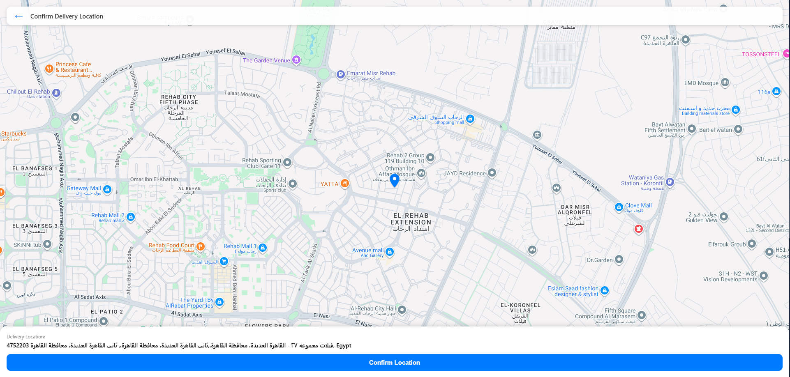

# Delivery Map App

An interactive delivery location selector built with **SvelteKit**, using the **Google Maps JavaScript SDK**.  
Users can drag the map to move the pin to set their delivery location. The app saves the location in `localStorage` and displays the street address dynamically.

## Watch the Demo

See a demo video [here](https://drive.google.com/file/d/10R8iiH1mXLhC38lrWxP2kvkMD_8RgHS9/view?usp=sharing).

## Features

- Interactive Google Maps with a centered custom pin
- Location saved to localStorage (restored across sessions)
- Reverse geocoding to show the real street address
- Responsive, mobile-first design for delivery apps
- Performance optimizations with async script loading

## Getting Started

See [INSTALL.md](./INSTALL.md) for setup documentation.

## Strategies

See [INSTALL.md](./INSTALL.md) for setup documentation.

## Performance

See [PERFORMANCE.md](./PERFORMANCE.md) for performance documentation.

## Contributors

- [Mahmoud Abou Eleneen (@mahmoudaboueleneen)](https://www.github.com/mahmoudaboueleneen)
